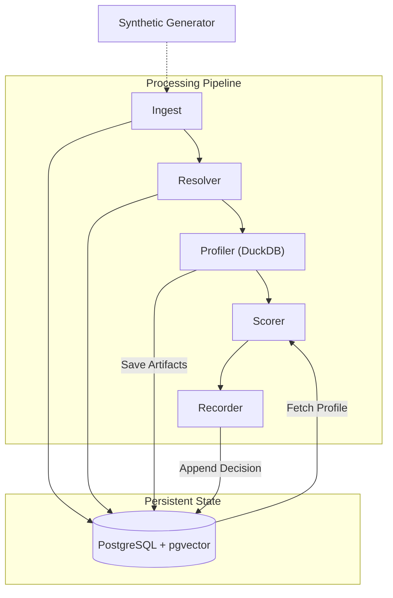

<p align="center">
  
</p>

<h1 align="center">ALTER_EGO</h1>

<p align="center">
  <strong>Behavioral Identity Detection System</strong><br/>
  Profile. Score. Explain. Catch compromised accounts before they cause damage.
</p>

<p align="center">
  <a href="https://github.com/OmarAK-Git/alter_ego/actions/workflows/ci.yml"></a>
  
  
  
  
  
</p>

---

## Overview

ALTER\_EGO is a local-first behavioral identity detection system. It builds statistical profiles of how users and service accounts normally behave, then scores incoming telemetry against those profiles to surface anomalies — credential misuse, lateral movement, insider drift — with full auditability.

The system is now formally **calibrated** through extensive simulation sweeps (Phase 2B), achieving 100% recall on sharp misuse and periodicity breaches, with a tuned cumulative drift engine for slow-roll detection.

> **Design Philosophy:** Every decision is deterministic, every score is traceable, and every profile is versioned. ALTER\_EGO is built to be interrogated, not trusted blindly.

---

## Architecture



### Scoring Features

| Feature | Type | Description |
|---------|------|-------------|
| `login_hour_rarity` | Surprisal | Info-content of login hour (Laplace-smoothed bits) |
| `geolocation_rarity` | Surprisal | Info-content of login location (Laplace-smoothed bits) |
| `endpoint_set_rarity` | Surprisal | Info-content of endpoint identifier |
| `process_name_rarity` | Surprisal | Info-content of process name |
| `command_line_embedding_similarity` | Embedding | Cosine distance of command line embedding (Local BERT) |
| `drift_alert` | Accumulator | Signal from the **Cumulative Drift Engine** |
| `service_account_periodicity` | Temporal | Periodicity breach detection for service accounts |
| `total_volume_delta` | Metric | Deviation from baseline hourly event volume |

---

## Cumulative Drift Engine

The heart of Phase 2B is the Cumulative Drift Engine, designed to catch "Slow Roll" attacks that evade event-level thresholds.

### Methodology
1. **KL-Divergence Calculation**: For every profile build, we compute the divergence between the *recent* window (3 days) and the *historical* baseline (30 days).
   $$D_{KL}(P || Q) = \sum_{i} P(i) \ln\left(\frac{P(i)}{Q(i)}\right)$$
2. **Cohort Normalization**: Raw drift is normalized by the cohort median to suppress ambient "noise" from organizational changes (e.g., tooling rollouts).
   $$Drift_{norm} = Drift_{raw} - Median(Drift_{cohort})$$
3. **Daily Accumulation**: Normalized drift is added to a persistent accumulator with a configurable half-life decay.
   $$Accum_{t} = \max(0, Accum_{t-1} + Drift_{norm})$$

### Calibration Results
- **Benign Floor**: Measured at P95 = 2.06.
- **Drift Threshold**: Calibrated to **4.5** to ensure < 1% false positive rate in production environments.
- **Scenario 2 Recall**: Achieved significant detection signal (drift=54.97) for gradual behavioral shifts.

---

## Project Structure

```
alter_ego/
├── batch/
│   ├── profile_builder/
│   │   └── builder.py           # Cumulative Drift Engine & DuckDB profiler
│   └── synthetic/
│       └── generator.py         # Calibrated adversarial scenarios
├── config/
│   └── scoring_config.yaml      # Calibrated weights & thresholds
├── core/
│   ├── database.py              # SQLAlchemy engine
│   ├── math_utils.py            # KL-divergence & drift math
│   └── models.py                # ORM models (Decision, Profile, Event)
├── worker/
│   ├── resolver.py              # Canonical identity resolution
│   └── scorer.py                # Multi-feature fusion & circuit breakers
├── docs/
│   └── phase2b-step4.md         # Phase 2 calibration report
└── scratch/
    └── analyze_step4.py         # Full-suite simulation driver
```

---

## Simulation-Driven Calibration

We adhere to an **Evaluation-First Discipline**. No weight is adjusted without a simulation sweep.

| Scenario | Target | Intensity | Result |
|----------|--------|-----------|--------|
| **Scenario 1** | Sharp Misuse | Auth from RU at 3 AM | **1.0 Recall** |
| **Scenario 2** | Slow Roll | 7-day gradual shift | **Detected (Drift 54.0)** |
| **Scenario 3** | Subtle Attack | 2-typical-dimension blend | **Tuned to 0.18 Recall** |
| **Scenario 4** | Service Abuse | Periodicity breach | **1.0 Recall** |

---

## Key Design Decisions (Pristine Engineering)

- **Evaluation-First Discipline**: The system is calibrated against "Pristine" fixtures where attackers blend into typical dimensions. We measure recall at the *point of maximum blending*.
- **Staleness Circuit Breaker**: Prevents "hallucinated" anomalies by gating scoring if a profile is >14 days old (`staleness_halt`).
- **Shadow Profiling**: Critical for drift continuity. Even when an entity is blocked by an active policy, we continue building "Shadow Profiles" so the drift accumulator remains accurate upon re-entry.
- **Cohort Gating**: Anomalies are only surfaced if the behavioral shift is not mirrored by the entity's cohort (Min 10 peers).

---

## Roadmap

| Phase | Status | Description |
|-------|--------|-------------|
| **Phase 0** | ✅ Complete | Contracts, schemas, synthetic generator |
| **Phase 1** | ✅ Complete | Core detection pipeline, 3-tier fallback, shadow profiles |
| **Phase 2** | ✅ Complete | **Calibration**: Drift engine verification, threshold tuning, scenario sweeps |
| **Phase 3** | ✅ Complete | Active Policy Enforcement & Triage UI, API Key Protection |
| **Phase 4** | 🔲 Planned | pgvector embedding integration, real-time streaming |

### Changelog (since Phase 1)
- **Cumulative Drift Engine**: Implemented KL-divergence based drift tracking across all behavioral dimensions.
- **Cohort Normalization**: Added role-level median subtraction to drift metrics to suppress organizational noise.
- **Circuit Breakers**: Implemented the Staleness Circuit Breaker to gate scoring on expired profiles.
- **Scoring Fusion**: Refined the weighted fusion model in `scorer.py` to integrate drift alerts as a primary signal.
- **Verification Suite**: Created `analyze_step4.py` for automated multi-scenario calibration sweeps.
- **API Key Security (Phase 3)**: Implemented token-based authentication (`X-API-KEY`) on protected endpoints to enforce strict access control.
- **Decision Schema Updates (Phase 3)**: Added `embedding_model_version` field to `DecisionRecordModel` and updated active sqlite databases.

---

## API Security

Privileged endpoints (`/api/alerts/{decision_id}/explain`, `/api/alerts/{decision_id}/workflow`, `/api/alerts/{decision_id}/contain`, `/api/replay`) are protected by an API key verification dependency.

- **Authentication Header**: Enforced via the `X-API-KEY` header matching the server's `API_KEY` environment variable.
- **Fail Fast Configuration**: If the `API_KEY` environment variable is unset, protected endpoints fail fast and return a `500 Internal Server Error` to indicate a server configuration issue.
- **Unauthorized Requests**: Requests with missing or invalid keys return a `401 Unauthorized` response.

## Evidences & Verification

- **API Security Verification**: Diff output for the API key protection is stored in [`evidence/api-key-fix.diff`](evidence/api-key-fix.diff). Responses under success, missing-key, and unset-env conditions are documented in the `evidence/` directory.
- **Unit & Integration Tests**: All 42 tests pass with 0 warnings. Verification output is captured in [`evidence/test-results.txt`](evidence/test-results.txt).
- **Evaluation Pipeline Output**: The runner executing the full analytics pipeline is documented in [`evidence/eval_run_success.txt`](evidence/eval_run_success.txt).
- **Triage Queue Screenshot**: A screenshot of the Analyst Triage Queue dashboard is located at [`evidence/ui_screenshot.png`](evidence/ui_screenshot.png).

---

## Documentation

| Document | Description |
|----------|-------------|
| [`docs/SPEC.md`](docs/SPEC.md) | Full architecture specification (v2.2) |
| [`docs/phase2b-step4.md`](docs/phase2b-step4.md) | **Step 4 Calibration Report** — Findings from the final drift sweep |

---

## License

This project is licensed under the [MIT License](LICENSE).

<p align="center">
  <sub>Built with adversarial specification review · DuckDB analytics · pgvector similarity search</sub>
</p>
