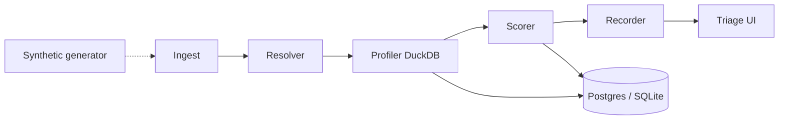

# ALTER_EGO

**Behavioral identity detection** — profile normal behavior, score anomalies deterministically, explain after the decision.

[](https://github.com/OmarAK-Git/alter_ego/actions/workflows/ci.yml)


---

## What it is

Local-first UEBA-style engine for a portfolio / single-operator deployment. It ingests auth and process telemetry (today: synthetic), builds **immutable versioned profiles**, scores new events with a multi-feature fusion model, and surfaces anomalies in an analyst triage UI.

> Every decision is deterministic, every score is traceable, every profile is versioned. The LLM never influences the score.

## Pipeline



| Feature | Role |
|---|---|
| login / geo / endpoint / process rarity | Laplace-smoothed surprisal |
| command_line embedding distance | Deterministic char 3-gram SHA-256 hash → **128-d** unit-norm vector (`alter-ego-ngram-v1`; not BERT / nomic) |
| drift_alert | Cumulative KL drift vs cohort median |
| service_account periodicity | Interval CV for scheduled accounts |

**Deferred (not in calibrated path):** `total_volume_delta` (hourly volume spike) — weight reserved in config; scorer emits contribution `0` with `volume_delta_deferred` until post–S3 calibration (S2.6).

Authoritative knobs: [`config/scoring_config.yaml`](config/scoring_config.yaml) (v2.2).

## Calibration status (honest)

Saved operating point from [`docs/calibration_final_metrics.json`](docs/calibration_final_metrics.json) at **anomaly_threshold = 45**:

| Scenario | Recall | Notes |
|---|---|---|
| S1 Sharp misuse | **1.0** | Geo / hour novelty |
| S2 Slow roll | **1.0** | Caught after S1/S2 integrity fixes (35/35) |
| S3 Subtle drift | **0.667** | 15 FN — primary attack-class residual |
| S4 Service abuse | **1.0** | Periodicity breach |

- **Precision:** ~0.019 · **Global recall:** ~0.817 · **FP:** 3448 — **not CALIBRATED**
- Residual detail: [`docs/phase2-s3-operating-point.md`](docs/phase2-s3-operating-point.md)
- Do not change weights without a full eval sweep (`batch/eval/` or `scratch/analyze_step*.py`).

## Phase map

Authoritative detail: [`memory-bank/progress.md`](memory-bank/progress.md).

| Phase | Status | What shipped / open |
|---|---|---|
| 0 Contracts + generator | **Partial** | Schemas, synthetic attacks, CI, app-layer audit chain — missing 4-container deploy, DB INSERT-only roles, migration playbook |
| 1 Detection pipeline | **Partial** | Shadow profiles, six-feature path, drift, novelty gate — geo histograms + drift KL (S1.2), eval partitions fixed (S1.1), auto containment queue (S1.3); open: lifecycle states, volume_delta |
| 2 Calibration | **Partial (Phase 2A)** | S1/S2/S4 recall 1.0 @ thr=45; S3 recall 0.667; 3448 FP — **not CALIBRATED** (see metrics table + operating-point note) |
| 3 UI + API + explain | **Partial** | Triage/detail UI, API key, explainer with slot isolation (S4.1) + queue-depth limit & template fallback (S4.2), suppressed-decisions view (S4.3), demo path (S4.4), first-class `replay_run_id` (S4.5) — open: suppressed-decisions aging escalation + jitter (deferred to Phase 4) |
| 4 Hardening / portfolio | **Open** | Four-container topology, DB roles, staleness escalation, empirical LLM check (SPEC_V3 §9) |

## Quick start

```bash
pip install -e ".[dev]"
pytest -v --tb=short
# optional Postgres
docker compose up -d
# API + triage UI
set API_KEY=dev-key   # required for privileged routes
uvicorn web.api:app --reload
```

Privileged routes expect header `X-API-KEY` matching `API_KEY`. See [`.env.example`](.env.example).

## Demo path

Reproducible analyst walkthrough (SPEC §11.5): **seed → triage → explain → simulated contain**. No live LLM required — without API keys the explainer uses deterministic template fallback.

**Automated test (in-memory DB, no server):**

```bash
pytest tests/web/test_demo_path.py -v
```

**Manual demo against a running server:**

```bash
# terminal 1 — API + triage UI
set API_KEY=dev-key
uvicorn web.api:app --reload

# terminal 2 — seed, then walk the API chain
python scripts/demo_path.py seed-and-run --api-key dev-key
```

Or step-by-step:

1. `python scripts/demo_path.py seed` — inserts alert `demo_path_alert` for entity `user_demo_path`
2. Open `http://localhost:8000` → Triage Queue → **Review** on `user_demo_path`
3. **Acknowledge** → **Generate** explanation → **Queue Containment** (simulated)

Cleanup: `python scripts/demo_path.py cleanup`

Core helpers live in [`scripts/demo_path.py`](scripts/demo_path.py) (`seed_demo_alert`, `run_demo_path`).

## Layout

```
core/          ORM, schemas, math, settings
worker/        ingest → resolve → score → record (+ vectorizer, explainer)
batch/         profile builder, synthetic scenarios, eval harness
web/           FastAPI + static triage UI
config/        scoring_config.yaml
memory-bank/   durable agent task memory
.workflow/     T3 accountable run slugs
docs/SPEC.md   architecture spec
```

## Agent workflow

This repo uses the local `ultimate-agentic-workflow` skill for accountable AI coding:

- Bootloaders: `AGENTS.md` / `CLAUDE.md` · lessons: `OPS.md`
- Live memory: `memory-bank/` · T3 runs: `.workflow/<slug>/`
- Claude Code stop gate: `.claude/stop-gate.json` runs `pytest` + `ruff` before the agent can finish

## Evidence

- Tests: [`evidence/test-results.txt`](evidence/test-results.txt)
- API key behavior: [`evidence/`](evidence/)
- Spec: [`docs/SPEC.md`](docs/SPEC.md)

## License

[MIT](LICENSE)
