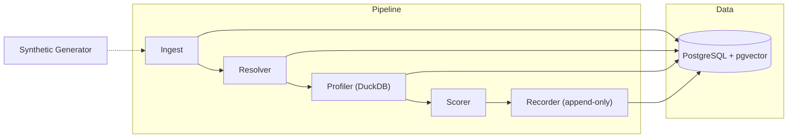

<p align="center">
  
</p>

<h1 align="center">ALTER_EGO</h1>

<p align="center">
  <strong>Behavioral Identity Detection System</strong><br/>
  Profile. Score. Explain. Catch compromised accounts before they cause damage.
</p>

<p align="center">
  <a href="https://github.com/OmarAK-Git/alter_ego/actions/workflows/ci.yml"></a>
  
  
  
  
  
</p>

---

## Overview

ALTER\_EGO is a local-first behavioral identity detection system. It builds statistical profiles of how users and service accounts normally behave, then scores incoming telemetry against those profiles to surface anomalies — credential misuse, lateral movement, insider drift — with full auditability.

The system works by:
1. **Ingesting** authentication and process telemetry events
2. **Resolving** raw identifiers to canonical entities
3. **Profiling** each entity's behavioral baseline using cohort-relative histograms
4. **Scoring** new events against the baseline with a multi-feature anomaly scoring engine
5. **Explaining** anomalous decisions with structured, auditable artifacts

> **Design Philosophy:** Every decision is deterministic, every score is traceable, and every profile is versioned. ALTER\_EGO is built to be interrogated, not trusted blindly.

---

## Architecture



### Scoring Features

| Feature | Type | Description |
|---------|------|-------------|
| `login_hour_rarity` | Categorical | Info-content of login hour against entity/cohort histogram |
| `geolocation_rarity` | Categorical | Rarity of source geolocation |
| `endpoint_set_rarity` | Categorical | Rarity of endpoint device |
| `process_name_rarity` | Categorical | Rarity of executed process name |
| `command_line_embedding_similarity` | Embedding | Cosine distance of command line embedding *(Phase 0.5)* |
| `service_account_execution_frequency_deviation` | Temporal | Periodicity deviation for service accounts *(Phase 0.5)* |
| `cumulative_drift` | Composite | KL-divergence of behavioral histograms across profile versions |

### 4-Tier Cohort Fallback

When an entity lacks sufficient local data, scoring falls back through a confidence-adaptive hierarchy:

```
Entity Local (≥10 events, confidence=1.0)
  └─→ Primary Cohort / Role (≥100 events, confidence=0.8)
      └─→ Parent Cohort / Entity Type (≥500 events, confidence=0.8)
          └─→ Global Terminus (confidence=0.5, cohort_unsupported flag)
```

---

## Project Structure

```
alter_ego/
├── batch/
│   ├── eval/
│   │   └── runner.py            # Time-stepping evaluation harness
│   ├── profile_builder/
│   │   └── builder.py           # DuckDB-based profile generation
│   └── synthetic/
│       └── generator.py         # High-fidelity synthetic event generator
├── config/
│   └── scoring_config.yaml      # Feature weights and thresholds
├── core/
│   ├── database.py              # SQLAlchemy engine and session
│   ├── math_utils.py            # KL-divergence, Laplace smoothing
│   ├── models.py                # ORM models (Postgres + pgvector)
│   ├── schemas/
│   │   ├── decisions.py         # DecisionRecord, FeatureContribution
│   │   ├── events.py            # Event, ResolvedEvent, SimulationPartition
│   │   └── profiles.py          # ProfileArtifact
│   └── settings.py              # Pydantic settings from .env
├── docs/
│   └── llm-determinism-check.md # LLM output variance analysis
├── scripts/
│   └── llm_determinism_check.py # Provider determinism verification
├── tests/                       # 11 tests covering scoring, audit, schemas
├── worker/
│   ├── ingest.py                # JSONL → database ingestion
│   ├── recorder.py              # Append-only decision recording
│   ├── resolver.py              # Raw ID → canonical entity resolution
│   └── scorer.py                # Multi-feature anomaly scoring engine
├── alembic/                     # Database migrations
├── docker-compose.yml           # PostgreSQL + pgvector
└── pyproject.toml
```

---

## Quick Start

### Prerequisites

- Python 3.11+
- Docker (for PostgreSQL + pgvector)

### Setup

```bash
# Clone
git clone https://github.com/OmarAK-Git/alter_ego.git
cd alter_ego

# Virtual environment
python -m venv .venv
source .venv/bin/activate        # Linux/Mac
# .\.venv\Scripts\activate       # Windows

# Install
pip install -e ".[dev]"

# Database
docker compose up -d
cp .env.example .env
alembic upgrade head
```

### Generate Synthetic Data & Run

```bash
# Generate 14 days of telemetry with 4 adversarial scenarios
python -m batch.synthetic.generator

# Run the time-stepping evaluation pipeline
python -m batch.eval.runner events.jsonl ground_truth.jsonl

# Run tests
pytest -v
```

---

## Synthetic Scenarios

The generator produces four adversarial scenarios for calibration, each tagged with a distinct `simulation_partition` label:

| # | Scenario | Partition Tag | What it tests |
|---|----------|---------------|---------------|
| 1 | **Sharp Credential Misuse** | `eval_scenario_1` | Login from unseen geolocation at 3 AM |
| 2 | **Slow-Roll Behavioral Drift** | `eval_scenario_2` | Gradual hour/process shift over 7 days |
| 3 | **Coordinated Compromise** | `eval_scenario_3` | 3 users in same cohort running `mimikatz.exe` |
| 4 | **Service Account Abuse** | `eval_scenario_4` | Off-schedule interactive command execution |

A fifth injection (`inject_tooling_rollout`) generates **correlated benign change** — multiple users in a cohort adopting a new process simultaneously — to test false positive suppression.

---

## Key Design Decisions

| Decision | Rationale |
|----------|-----------|
| **Deterministic Decision IDs** | `SHA-256(event_id ‖ profile_version ‖ scoring_config_version)` — same inputs always produce the same decision, enabling replay and audit |
| **Append-Only Decisions** | Insert-only at the application layer (`IntegrityError` on duplicates) and Postgres role level (`REVOKE UPDATE`) |
| **Shadow Profiles** | Blocked entities still get profiled (`is_shadow=True`) so drift accumulates; scorer reads only non-shadow profiles |
| **Confidence Aggregation** | Weighted mean of per-feature confidences by contribution magnitude — terminus-level features carry 0.5 confidence, enabling suppressed-decisions filtering |
| **Local Embeddings** | Defaults to `nomic-embed-text` (768d) — no external API dependency for a security detection system |

---

## Roadmap

| Phase | Status | Description |
|-------|--------|-------------|
| **Phase 0** | ✅ Complete | Contracts, schemas, synthetic generator, LLM determinism check |
| **Phase 1** | ✅ Complete | Core detection pipeline, 4-tier fallback, shadow profiles, drift detection |
| **Phase 2** | 🔲 Next | Calibration gate — threshold tuning via per-scenario P/R curves |
| **Phase 3** | 🔲 Planned | Triage UI and analyst workflow |
| **Phase 4** | 🔲 Planned | pgvector embedding integration, real-time streaming |

---

## Configuration

All scoring parameters live in [`config/scoring_config.yaml`](config/scoring_config.yaml). These are provisional defaults — Phase 2 calibration will sweep thresholds and weights against the synthetic scenario P/R curves.

```yaml
version: "1.0"

anomaly_threshold: 75.0          # Score above which an event is flagged
confidence_floor: 0.6            # Minimum confidence to surface a decision
drift_weight: 1.0                # Multiplier for cumulative drift contribution

features:
  login_hour_rarity:
    weight: 1.0
  geolocation_rarity:
    weight: 1.5
  endpoint_set_rarity:
    weight: 1.2
  process_name_rarity:
    weight: 1.0
  command_line_embedding_similarity:
    weight: 2.0                  # Stub zeroed until Phase 0.5 embedding model
  service_account_execution_frequency_deviation:
    weight: 1.5                  # Stub zeroed until Phase 0.5 periodicity model

cohort_minimums:
  min_events_for_entity_baseline: 100
  min_entities_for_cohort: 5

suppressed_decision_aging_days: 7
replay_window_limits_days: 30
```

---

## Documentation

| Document | Description |
|----------|-------------|
| [`docs/SPEC.md`](docs/SPEC.md) | Full architecture specification (v2) — produced through adversarial LLM debate before any code was written |
| [`docs/llm-determinism-check.md`](docs/llm-determinism-check.md) | Empirical analysis of LLM output variance at temperature=0 |

---

## License

This project is licensed under the [MIT License](LICENSE).

<p align="center">
  <sub>Built with adversarial specification review · DuckDB analytics · pgvector similarity search</sub>
</p>
