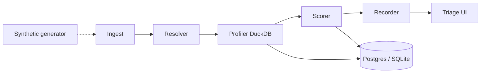

# ALTER_EGO

**Behavioral identity detection** — profile normal behavior, score anomalies deterministically, explain after the decision.

[](https://github.com/OmarAK-Git/alter_ego/actions/workflows/ci.yml)


---

## What it is

Local-first UEBA-style engine for a portfolio / single-operator deployment. It ingests auth and process telemetry (today: synthetic), builds **immutable versioned profiles**, scores new events with a multi-feature fusion model, and surfaces anomalies in an analyst triage UI.

> Every decision is deterministic, every score is traceable, every profile is versioned. The LLM never influences the score.

**Program status (2026-07-14):** S0–S6 portfolio-ready T3 run is **drained** (all packets + exit gates closed). Phases 0–4 remain **Partial** — **not CALIBRATED.** Operator-owned next step is personal drift-methodology research ([`docs/residual-risk-drift-hypotheses.md`](docs/residual-risk-drift-hypotheses.md)).

## Pipeline



| Feature | Role |
|---|---|
| login / geo / endpoint / process rarity | Laplace-smoothed surprisal |
| command_line embedding distance | Deterministic char 3-gram SHA-256 hash → **128-d** unit-norm vector (`alter-ego-ngram-v1`; not BERT / nomic) |
| drift_alert | Cumulative KL drift vs cohort median |
| service_account periodicity | Interval CV for scheduled accounts |

**Deferred (not in calibrated path):** `total_volume_delta` (hourly volume spike) — weight reserved in config; scorer emits contribution `0` with `volume_delta_deferred` until post–S3 calibration (S2.6).

Authoritative knobs: [`config/scoring_config.yaml`](config/scoring_config.yaml) (v2.2).

## Calibration status (honest)

Saved operating point from [`docs/calibration_final_metrics.json`](docs/calibration_final_metrics.json) at **anomaly_threshold = 45**:

| Scenario | Recall | Notes |
|---|---|---|
| S1 Sharp misuse | **1.0** | Geo / hour novelty |
| S2 Slow roll | **1.0** | Caught after S1/S2 integrity fixes (35/35) |
| S3 Subtle drift | **0.667** | 15 FN — primary attack-class residual |
| S4 Service abuse | **1.0** | Periodicity breach |

- **Precision:** ~0.019 · **Global recall:** ~0.817 · **FP:** 3448 — **not CALIBRATED**
- Residual detail: [`docs/phase2-s3-operating-point.md`](docs/phase2-s3-operating-point.md)
- Do not change weights without a full eval sweep + governance record (see [`docs/hardening-sweep-checklist.md`](docs/hardening-sweep-checklist.md)).

## What S5–S6 hardening shipped

| Area | What you get |
|---|---|
| Deploy | Four-container `docker compose` (web / worker / batch / postgres) — [`docs/deployment.md`](docs/deployment.md) |
| Audit | INSERT-only `alter_ego_app` DB role + scheduled hash-chain integrity job |
| Fail-closed | Staleness halt, embedding-metadata mismatch halt, profile build-block supervisor escalation |
| Explain | Slot-isolated LLM fields, queue-depth template fallback, counterfactual consistency harness |
| Lineage | Empirical LLM check on Vertex `gemini-3.5-flash`: **not byte-identical** at temp=0 — immutable explanation lineage is authoritative ([`docs/llm-determinism-check.md`](docs/llm-determinism-check.md)) |
| Handoff | Sweep checklist + residual/drift hypotheses + OPS standing rule (no knob change without recorded sweep) |

## Phase map

Authoritative detail: [`memory-bank/progress.md`](memory-bank/progress.md).

| Phase | Status | What shipped / open |
|---|---|---|
| 0 Contracts + generator | **Partial** | Schemas, synthetic attacks, CI, app-layer audit chain, compose deploy, DB roles, audit integrity job, pgvector playbook. LLM determinism **executed** (provider non-deterministic → lineage rule confirmed) |
| 1 Detection pipeline | **Partial** | Shadow profiles, six-feature path, drift, novelty gate, geo/drift KL, auto containment queue, embedding mismatch halt; open: lifecycle states, `volume_delta` |
| 2 Calibration | **Partial (Phase 2A)** | S1/S2/S4 recall 1.0 @ thr=45; S3 recall 0.667; 3448 FP — **not CALIBRATED** |
| 3 UI + API + explain | **Partial** | Triage UI, slot isolation, queue-depth fallback, suppressed view, demo path, `replay_run_id`. **Deferred:** suppressed-decisions aging + jitter |
| 4 Hardening / portfolio | **Partial** | S5 + S6 program closed. **Deferred:** advanced cohort prior-update gates, K8s/Terraform, debate transcripts. **Operator open:** personal drift research → optional re-sweep |

## Quick start

```bash
pip install -e ".[dev]"
pytest -v --tb=short          # unit/integration suite (live smoke skipped by default)
# pytest --live tests/live -v  # optional HTTP smoke — needs free :8000

# Four-container stack — see docs/deployment.md
docker compose up -d --build

# Or local API + triage UI (SQLite or existing Postgres)
set API_KEY=dev-key
uvicorn web.api:app --reload
```

Privileged routes expect header `X-API-KEY` matching `API_KEY`. See [`.env.example`](.env.example).

## Demo

Reproducible analyst walkthrough: **seed → triage → explain → simulated contain**. No live LLM required — without API keys the explainer uses deterministic template fallback.

### One-liner automated check

```bash
pytest tests/web/test_demo_path.py -v
```

### Live demo (UI + API)

```bash
# terminal 1
set API_KEY=dev-key
uvicorn web.api:app --reload

# terminal 2
python scripts/demo_path.py seed-and-run --api-key dev-key
```

Then open [http://localhost:8000](http://localhost:8000) → Triage Queue → **Review** on `user_demo_path` → Acknowledge → Generate explanation → Queue Containment (simulated).

Step-by-step:

| Step | Command / action |
|---|---|
| 1. Seed | `python scripts/demo_path.py seed` |
| 2. Triage | UI: Review `user_demo_path` / alert `demo_path_alert` |
| 3. Explain | **Generate** (template fallback if no LLM keys) |
| 4. Contain | **Queue Containment** (simulated — no real IAM disable) |
| 5. Cleanup | `python scripts/demo_path.py cleanup` |

Helpers: [`scripts/demo_path.py`](scripts/demo_path.py).

### Docker demo

```bash
cp .env.example .env   # set API_KEY at minimum
docker compose up -d --build
# UI on the published web port — see docs/deployment.md
python scripts/demo_path.py seed-and-run --api-key "$API_KEY" --base-url http://localhost:8000
```

## Portfolio docs

| Doc | Purpose |
|---|---|
| [`docs/deployment.md`](docs/deployment.md) | Four-container topology, DB role matrix, bring-up |
| [`docs/hardening-sweep-checklist.md`](docs/hardening-sweep-checklist.md) | Re-sweep commands, seeds, artifacts after drift research |
| [`docs/residual-risk-drift-hypotheses.md`](docs/residual-risk-drift-hypotheses.md) | Open FP/FN + drift research hypotheses (operator) |
| [`docs/pgvector-embedding-migration.md`](docs/pgvector-embedding-migration.md) | Embedding model / dimensionality change playbook |
| [`docs/llm-determinism-check.md`](docs/llm-determinism-check.md) | §8.4 empirical check (executed 2026-07-14; not bit-identical) |
| [`docs/counterfactual-consistency.md`](docs/counterfactual-consistency.md) | Top-K counterfactual harness |

## What's left (operator)

1. **Personal drift research** — work through [`docs/residual-risk-drift-hypotheses.md`](docs/residual-risk-drift-hypotheses.md)
2. **Optional re-sweep** — only after research conclusions, using [`docs/hardening-sweep-checklist.md`](docs/hardening-sweep-checklist.md) + OPS governance
3. Deferred product items (not blocking portfolio bar): cohort prior-update gates, K8s/Terraform, calendar dual-score, lifecycle states, `volume_delta`

## Layout

```
core/          ORM, schemas, math, settings
worker/        ingest → resolve → score → record (+ vectorizer, explainer)
batch/         profile builder, synthetic scenarios, eval harness, audit_integrity
web/           FastAPI + static triage UI
config/        scoring_config.yaml
memory-bank/   durable agent task memory
.workflow/     T3 accountable run slugs
docs/SPEC.md   architecture spec
```

## Agent workflow

This repo uses the local `ultimate-agentic-workflow` skill for accountable AI coding:

- Bootloaders: `AGENTS.md` / `CLAUDE.md` · lessons: `OPS.md`
- Live memory: `memory-bank/` · T3 runs: `.workflow/<slug>/`
- Claude Code stop gate: `.claude/stop-gate.json` runs `pytest` + `ruff` before the agent can finish

## Evidence

- Tests: [`evidence/test-results.txt`](evidence/test-results.txt)
- API key behavior: [`evidence/`](evidence/)
- Spec: [`docs/SPEC.md`](docs/SPEC.md)
- T3 closeout: `.workflow/2026-07-12-v1-portfolio-ready/` (S6-EXIT-GATE passed)

## License

[MIT](LICENSE)
